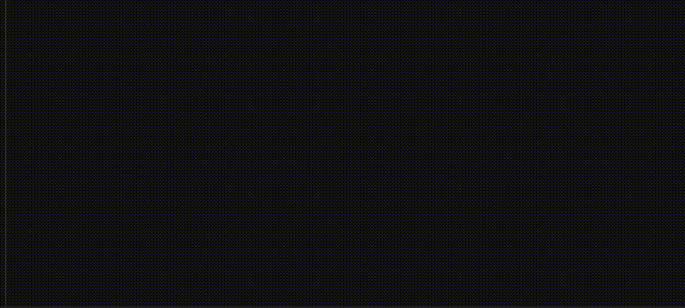
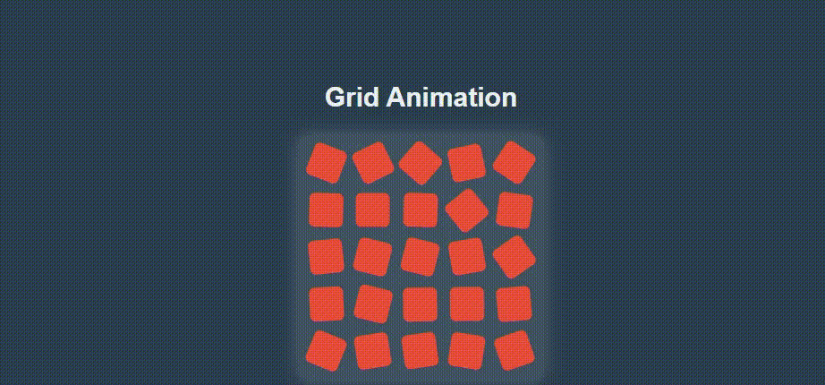

# Animation Effects Collection

This project contains a collection of animation effects using **Anime.js**, including various interactive animations like:
- **AJAX Loader**: A smooth and animated circular loader.
- **Circular Animation**: A rotating circular animation with multiple elements.
- **Different Shapes Animation**: Animating various shapes with scaling, rotation, and opacity effects.
- **Grid Animation**: Creating an animated grid of shapes with various effects.

Each animation can be triggered via button clicks and demonstrates different uses of **Anime.js** for creating smooth animations on the web.

## Features
- **AJAX Loader**: A loader that displays an animated rotating circle to indicate loading.
- **Circular Animation**: Animates multiple elements rotating around a central point.
- **Different Shapes Animation**: Animates various shapes (circle, square) with scaling, opacity, and movement.
- **Grid Animation**: A grid layout where elements animate with different effects like rotation and scaling.

## Demos

1. **AJAX Loader**: A loading spinner is animated using **Anime.js** to indicate a loading state.

2. **Circular Animation**: A circular animation where multiple shapes rotate around a center.

3. **Different Shapes Animation**: Shapes appear randomly and animate with rotation, scaling, and fading.


4. **Grid Animation**: A grid layout of shapes that animate in various ways when triggered.



## Installation

You can add **Anime.js** to your project either by using a CDN or installing it via npm.

### Using CDN

Add the following CDN link to the `<head>` section of your `index.html`:

```html
<script src="https://cdnjs.cloudflare.com/ajax/libs/animejs/3.2.1/anime.min.js"></script>
